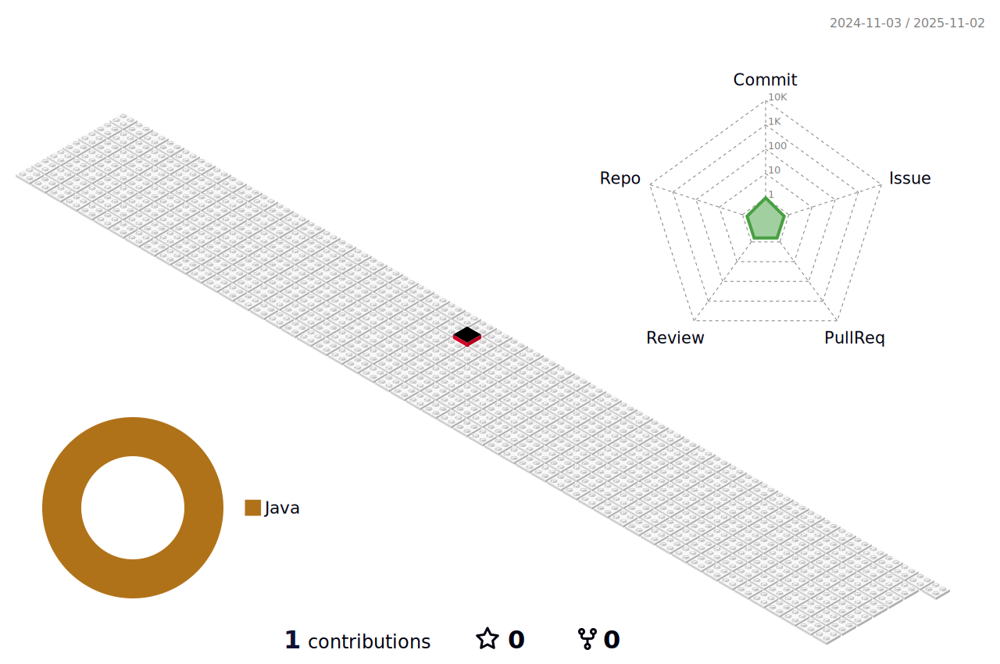

<!-- ### Hi there 👋 -->

<!--
**syulyul/syulyul** is a ✨ _special_ ✨ repository because its `README.md` (this file) appears on your GitHub profile.

Here are some ideas to get you started:

- 🔭 I’m currently working on ...
- 🌱 I’m currently learning ...
- 👯 I’m looking to collaborate on ...
- 🤔 I’m looking for help with ...
- 💬 Ask me about ...
- 📫 How to reach me: ...
- 😄 Pronouns: ...
- ⚡ Fun fact: ...
-->

	<h3> 🌱 SNS & Portfolio 🌱 </h3>

<!-- Hits -->

	
	
	

 
 

<!--
기술 스택 아이콘

flat (default), flat-square, plastic, for-the-badge, social
주석 처리 된 기술 => 숙련도 미흡 또는 습득 예정
-->

	<h3>🌱 Tech Stack 🌱</h3>
	<table width="100%">
	  <tr>
			<th rowspan="1">
				<b>Base</b>
			</th>
			<td>Language</td>
			<td>
				
				<!--  -->
				<!--  -->
			</td>
		</tr>
	  <tr>
			<th rowspan="1">
				<b>FrontEnd</b>
			</th>
			<td>Platform</td>
			<td>
				
				
        
        
				
  			
				
			</td>
		</tr>
		<tr>
			<th rowspan="2">
				<b>BackEnd</b>
			</th>
			<td>Platform</td>
			<td>
        
				
        
				
				
				
			</td>
		</tr>
		<tr>
			<td>ORM</td>
			<td>
				
				
				<!--  -->
			</td>
		</tr>
		<tr>
			<th rowspan="1"><b>DataBase</b></th>
			<td>DBMS</td>
			<td>
				
				
				
			</td>
		</tr>
		<tr>
			<th rowspan="4"><b>ETC</b></th>
			<td>VCS</td>
			<td>
				
				
				
			</td>
		</tr>
		<!-- <tr>
			<td>OS</td>
			<td>
      	
				
				
				
			</td>
		</tr> -->
		<tr>
			<td>IDE</td>
			<td>
				
				
				
			</td>
		</tr>
		<tr>
			<td>ETC</td>
			<td>
      	<!--  -->
				
				<!--  -->
			</td>
		</tr>
		<tr>
			<td>BUILD, DEPLOY</td>
			<td>
				
				
				
				<!--  -->
				<!--  -->
				<!--  -->
		</tr>
	</table>
       

	

